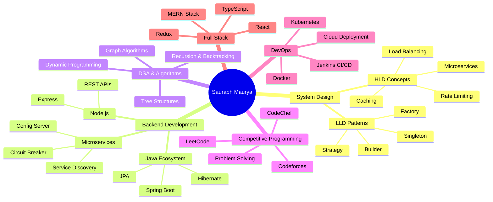
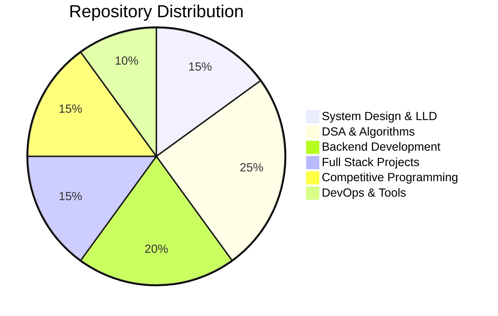

<div align="center">
  
</div>

<div align="center">
  
  [](https://git.io/typing-svg)
  
  <br/>
  
  [](https://www.linkedin.com/in/saurabh-maurya-ba2275188/)
  [](https://www.codechef.com/users/saurabh_9695)
  [](https://leetcode.com/saurabh_9695/)
  [](https://github.com/SaurabhMaurya9695)
  [](mailto:saurabhyash1707@gmail.com)
  
  
  
  
  
</div>

---

## 👨‍💻 About Me

```java
public class SaurabhMaurya extends SoftwareDeveloper implements CompetitiveProgrammer {
    
    private final String currentRole = "Software Developer 1 @ Boomi";
    private final String location = "India 🇮🇳";
    private final int totalRepositories = 83;
    
    @Override
    public String[] getExpertise() {
        return new String[] {
            "🏗️  System Design (LLD & HLD)",
            "💻 Backend Development (Java, Spring Boot, Microservices)",
            "⚡ Data Structures & Algorithms",
            "🧩 Competitive Programming (C++)",
            "🌐 Full Stack Development (MERN Stack)",
            "☁️  DevOps & Cloud (Docker, Kubernetes, Jenkins)",
            "🔧 Design Patterns & Architecture"
        };
    }
    
    @Override
    public String[] getCurrentlyLearning() {
        return new String[] {
            "Advanced System Design Patterns",
            "Distributed Systems & Scalability",
            "Event-Driven Architecture",
            "Microservices Best Practices",
            "Cloud Native Technologies"
        };
    }
    
    @Override
    public Map<String, Integer> getCodingStats() {
        return Map.of(
            "LeetCode Problems", 500,
            "CodeChef Contests", 50,
            "GitHub Repos", 83,
            "Years Coding", 4
        );
    }
}
```

<table>
  <tr>
    <td>🎯</td>
    <td><strong>Current Role:</strong> Software Developer 1 @ <strong>Boomi</strong></td>
  </tr>
  <tr>
    <td>🏗️</td>
    <td><strong>Expertise:</strong> System Design, Backend Architecture, Microservices</td>
  </tr>
  <tr>
    <td>💻</td>
    <td><strong>Primary Languages:</strong> Java, C++, JavaScript/TypeScript</td>
  </tr>
  <tr>
    <td>🧠</td>
    <td><strong>Focus Areas:</strong> LLD/HLD, DSA, Competitive Programming</td>
  </tr>
  <tr>
    <td>🌱</td>
    <td><strong>Learning:</strong> Advanced Design Patterns, Event-Driven Systems</td>
  </tr>
  <tr>
    <td>📫</td>
    <td><strong>Reach Me:</strong> saurabhyash1707@gmail.com</td>
  </tr>
</table>

---

## 🚀 Technical Expertise

### 💻 Programming Languages

<div align="center">


</div>

### 🏗️ System Design & Architecture

<table>
  <tr>
    <td align="center" width="33%">
      
      <br/><strong>Low-Level Design</strong>
      <br/><sub>Design Patterns, SOLID Principles</sub>
      <br/><sub>Factory, Builder, Strategy, Singleton</sub>
    </td>
    <td align="center" width="33%">
      
      <br/><strong>High-Level Design</strong>
      <br/><sub>Scalability, Microservices</sub>
      <br/><sub>Rate Limiting, Caching, Load Balancing</sub>
    </td>
    <td align="center" width="33%">
      
      <br/><strong>Event-Driven</strong>
      <br/><sub>Kafka, Message Queues</sub>
      <br/><sub>Asynchronous Processing</sub>
    </td>
  </tr>
</table>

### 🔧 Backend Development

<div align="center">


</div>

**Specialized In:**
- 🏗️ Microservices Architecture (Spring Boot)
- 🔐 Authentication & Authorization
- 📧 Email Services & Verification Systems
- 🏨 Hotel Rating Systems
- 🛒 E-Commerce Platforms
- ⚙️ Config Servers & Service Discovery

### 🌐 Frontend Development

<div align="center">


</div>

### 🗄️ Databases & Caching

<div align="center">


</div>

### ☁️ DevOps & Tools

<div align="center">


</div>

---

## 📚 Repository Highlights (83+ Repositories)

### 🏗️ System Design & LLD

<table>
  <tr>
    <td width="33%" align="center">
      
      <br/><strong>JAVA-LLD</strong>
      <br/><sub>Low-Level Design Patterns</sub>
      <br/><sub>Design Principles, SOLID</sub>
    </td>
    <td width="33%" align="center">
      
      <br/><strong>Backend Projects</strong>
      <br/><sub>Rate Limiters, System Design</sub>
      <br/><sub>Production-Ready Code</sub>
    </td>
    <td width="33%" align="center">
      
      <br/><strong>Event-Driven</strong>
      <br/><sub>Kafka, Message Queues</sub>
      <br/><sub>Async Processing</sub>
    </td>
  </tr>
</table>

### 🧮 Data Structures & Algorithms

<table>
  <tr>
    <td width="25%" align="center">
      <strong>📊 DP Problems</strong>
      <br/><sub>Basic to Advanced</sub>
      <br/><sub>Comprehensive Solutions</sub>
    </td>
    <td width="25%" align="center">
      <strong>🌲 Trees & Graphs</strong>
      <br/><sub>BST, Segment Trees, Tries</sub>
      <br/><sub>Graph Algorithms</sub>
    </td>
    <td width="25%" align="center">
      <strong>🔄 Recursion</strong>
      <br/><sub>Basic to Advanced</sub>
      <br/><sub>Backtracking Problems</sub>
    </td>
    <td width="25%" align="center">
      <strong>💻 LeetCode</strong>
      <br/><sub>500+ Problems Solved</sub>
      <br/><sub>Regular Contests</sub>
    </td>
  </tr>
</table>

### 🏢 Microservices & Enterprise

<table>
  <tr>
    <td width="50%">
      <h4>🏨 Hotel Rating System</h4>
      <sub>Spring Boot Microservices</sub><br/>
      <sub>Service Discovery, Config Server</sub><br/>
      <sub>Load Balancing, Circuit Breaker</sub>
    </td>
    <td width="50%">
      <h4>🛒 Electronic Store</h4>
      <sub>E-Commerce Platform</sub><br/>
      <sub>RESTful APIs, JWT Auth</sub><br/>
      <sub>Payment Integration</sub>
    </td>
  </tr>
  <tr>
    <td width="50%">
      <h4>📧 Email Service</h4>
      <sub>Email Sender & Verification</sub><br/>
      <sub>OTP System, Templates</sub><br/>
      <sub>Async Processing</sub>
    </td>
    <td width="50%">
      <h4>⚙️ Config Server</h4>
      <sub>Centralized Configuration</sub><br/>
      <sub>Spring Cloud Config</sub><br/>
      <sub>Environment Management</sub>
    </td>
  </tr>
</table>

### 🌐 Full-Stack Applications

- **🤝 TeamCodeHub** - Collaborative coding platform (MERN Stack)
- **🏥 Insurance Portal** - TypeScript, Full-featured portal
- **📝 LEX Clone** - Quiz application in Java
- **⚛️ React Learning** - Modern React patterns and practices

### 🚀 DevOps & Infrastructure

- **🐳 Kubernetes Learning** - Container orchestration
- **⚙️ Jenkins Basics** - CI/CD pipelines
- **🔧 Docker** - Containerization practices

### 🏆 Competitive Programming

<div align="center">

| Repository | Language | Focus Area |
|------------|----------|------------|
| 🔵 CodeChef Training | C++ | Contest Problems |
| 🟡 Codeforces Training | C++ | Rated Contests |
| 🟢 LeetCode Codes | C++ | 500+ Problems |
| 🟣 100 Days of Code | C++ | Daily Practice |
| 🔴 CP Templates | C++ | Competitive Templates |

</div>

---

## 📊 GitHub Statistics

<div align="center">
  
  
</div>

<div align="center">
  
  [](https://git.io/streak-stats)
  
</div>

<div align="center">
  
  
  
</div>

<div align="center">

### 📈 Contribution Graph


</div>

---

## 🎯 Core Competencies Map



---

## 🏆 Competitive Programming Journey

<div align="center">

| Platform | Profile | Activity | Achievements |
|----------|---------|----------|--------------|
| 🍳 **CodeChef** | [@saurabh_9695](https://www.codechef.com/users/saurabh_9695) | Regular Contests | Active Problem Solver |
| 💻 **LeetCode** | [@saurabh_9695](https://leetcode.com/saurabh_9695/) | 500+ Problems | Contest Participant |
| 📘 **Codeforces** | Active Trainer | Training Repository | Problem Sets |

</div>

### 📚 DSA Repositories Portfolio

<details>
<summary><b>🔍 Click to expand DSA Collection</b></summary>

- **DP-BASIC-TO-ADVANCE** - Comprehensive Dynamic Programming solutions
- **Graph-basic-to-Advance** - Graph algorithms and implementations
- **Trees** - BST, Segment Trees, Trie implementations
- **Recursion-basic-To-advance** - Recursion patterns and backtracking
- **DSA-1.0** - Complete DSA course implementations
- **DSA-And-LLD** - Combined DSA and Low-Level Design

</details>

---

## 💼 Professional Experience

### 🏢 Software Developer 1 @ Boomi
**Present**

- 🔧 Building scalable backend systems
- 🏗️ Implementing microservices architecture
- 🔄 Working with event-driven systems
- 📊 Optimizing system performance and reliability

---

## 🌟 Featured Skills Matrix

<table>
  <tr>
    <th>Category</th>
    <th>Skills</th>
    <th>Proficiency</th>
  </tr>
  <tr>
    <td><strong>System Design</strong></td>
    <td>LLD, HLD, Design Patterns, Scalability</td>
    <td>⭐⭐⭐⭐⭐</td>
  </tr>
  <tr>
    <td><strong>Backend</strong></td>
    <td>Java, Spring Boot, Microservices, REST APIs</td>
    <td>⭐⭐⭐⭐⭐</td>
  </tr>
  <tr>
    <td><strong>DSA</strong></td>
    <td>DP, Graphs, Trees, Algorithms</td>
    <td>⭐⭐⭐⭐⭐</td>
  </tr>
  <tr>
    <td><strong>Competitive Programming</strong></td>
    <td>C++, Problem Solving, Contests</td>
    <td>⭐⭐⭐⭐</td>
  </tr>
  <tr>
    <td><strong>Full Stack</strong></td>
    <td>React, Redux, Node.js, TypeScript</td>
    <td>⭐⭐⭐⭐</td>
  </tr>
  <tr>
    <td><strong>DevOps</strong></td>
    <td>Docker, Kubernetes, Jenkins, CI/CD</td>
    <td>⭐⭐⭐⭐</td>
  </tr>
  <tr>
    <td><strong>Databases</strong></td>
    <td>MongoDB, MySQL, Redis</td>
    <td>⭐⭐⭐⭐</td>
  </tr>
</table>

---

## 📖 Learning Journey & Focus Areas

### 🎯 2025 Goals

```java
public class Goals2025 {
    private List<String> technicalGoals = Arrays.asList(
        "Master Advanced System Design Patterns",
        "Deep Dive into Distributed Systems",
        "Build Scalable Microservices Architecture",
        "Contribute to Major Open Source Projects",
        "Achieve CodeChef 5★ Rating",
        "Complete 1000 LeetCode Problems"
    );
    
    private List<String> learning = Arrays.asList(
        "Event-Driven Architecture",
        "Cloud Native Technologies",
        "Advanced Kafka & Message Queues",
        "System Performance Optimization",
        "Advanced Design Patterns"
    );
}
```

### 📚 Current Focus

- 🏗️ **System Design**: Building production-ready scalable systems
- 🔄 **Event-Driven Architecture**: Kafka, Message Queues, Async Processing
- ☁️ **Cloud Technologies**: Docker, Kubernetes, Microservices
- 🧠 **Advanced DSA**: Competitive Programming, Complex Algorithms
- 🏢 **Enterprise Patterns**: Spring Boot, Microservices Best Practices

---

## 🎨 Project Categories

<div align="center">



</div>

---

## 🤝 Let's Connect & Collaborate

<div align="center">


### 💡 I'm always interested in:

<table>
  <tr>
    <td align="center" width="16.66%">
      
      <br/><sub><b>System Design</b></sub>
    </td>
    <td align="center" width="16.66%">
      
      <br/><sub><b>Backend Dev</b></sub>
    </td>
    <td align="center" width="16.66%">
      
      <br/><sub><b>Algorithms</b></sub>
    </td>
    <td align="center" width="16.66%">
      
      <br/><sub><b>Open Source</b></sub>
    </td>
    <td align="center" width="16.66%">
      
      <br/><sub><b>Collaboration</b></sub>
    </td>
    <td align="center" width="16.66%">
      
      <br/><sub><b>Knowledge Share</b></sub>
    </td>
  </tr>
</table>

<br/>

### 📬 Reach Out To Me

[](https://www.linkedin.com/in/saurabh-maurya-ba2275188/)
[](mailto:saurabhyash1707@gmail.com)
[](https://github.com/SaurabhMaurya9695)
[](https://www.instagram.com/__saurabh__9695/)

</div>

---

## 💭 Developer Philosophy

<div align="center">

> *"Code is like humor. When you have to explain it, it's bad."* – Cory House

> *"First, solve the problem. Then, write the code."* – John Johnson

> *"The best error message is the one that never shows up."* – Thomas Fuchs

</div>

---

## 🎯 Fun Facts

```javascript
const saurabhMaurya = {
    code: ['Java', 'C++', 'JavaScript', 'TypeScript', 'Python'],
    askMeAbout: ['System Design', 'Backend Dev', 'DSA', 'Microservices'],
    technologies: {
        backend: ['Spring Boot', 'Node.js', 'Microservices'],
        frontend: ['React', 'Redux', 'TypeScript'],
        databases: ['MongoDB', 'MySQL', 'Redis'],
        devOps: ['Docker', 'Kubernetes', 'Jenkins'],
        architecture: ['Design Patterns', 'LLD', 'HLD']
    },
    currentFocus: 'Building scalable distributed systems',
    funFact: 'I debug with print statements and I\'m not ashamed!'
};
```

---

## 📈 Contribution Activity

<div align="center">


<br/><br/>

<!--START_SECTION:activity-->
<!--END_SECTION:activity-->

### 🔥 Streak Stats


### 📊 Weekly Development Breakdown


<!--START_SECTION:waka-->
<!--END_SECTION:waka-->

</div>

---

## 🏆 GitHub Trophies

<div align="center">


<br/><br/>


</div>

---

## 💡 Random Dev Quote

<div align="center">


</div>

---

## 📊 GitHub Metrics

<div align="center">


</div>

---

<div align="center">


### 🌟 Support My Work

<br/>

**If you find my projects helpful or interesting, consider:**

<br/>

<table align="center">
  <tr>
    <td align="center" width="25%">
      
      <br/><strong>Starring</strong>
      <br/><sub>repositories you like</sub>
    </td>
    <td align="center" width="25%">
      
      <br/><strong>Sharing</strong>
      <br/><sub>with the community</sub>
    </td>
    <td align="center" width="25%">
      
      <br/><strong>Providing</strong>
      <br/><sub>feedback and suggestions</sub>
    </td>
    <td align="center" width="25%">
      
      <br/><strong>Collaborating</strong>
      <br/><sub>on interesting projects</sub>
    </td>
  </tr>
</table>

<br/>

---

### 📈 Detailed Profile Stats


---

### 🎓 Continuous Learner | 💻 Problem Solver | 🚀 Innovation Driver

<sub>💡 **Browse my 83+ repositories** to see my journey from competitive programming to enterprise-level system design!</sub>

---


**Made with 💙 by Saurabh Maurya**

</div>

